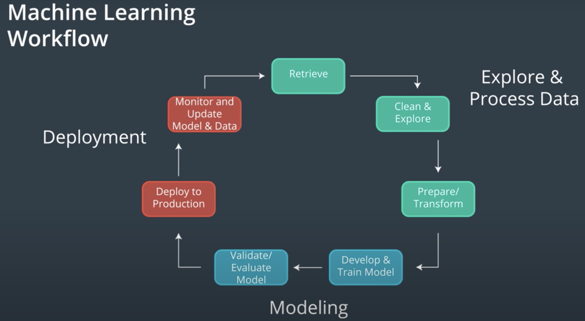
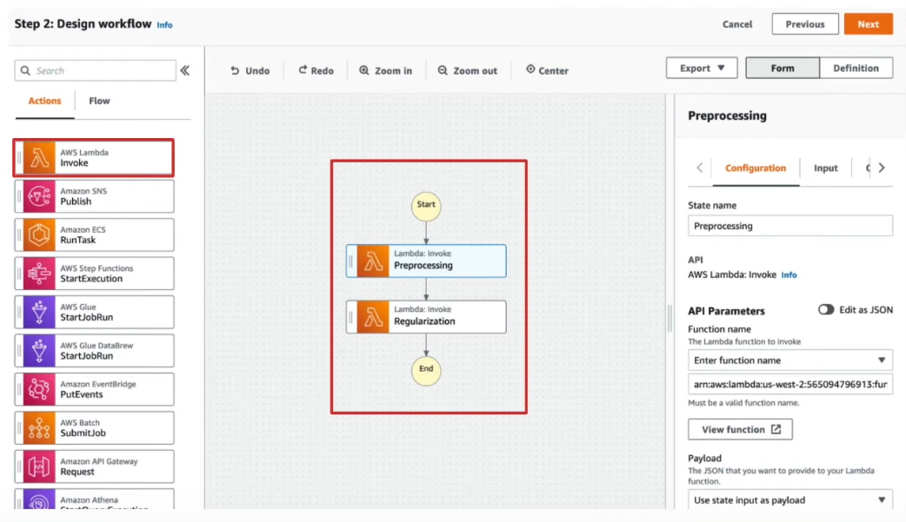
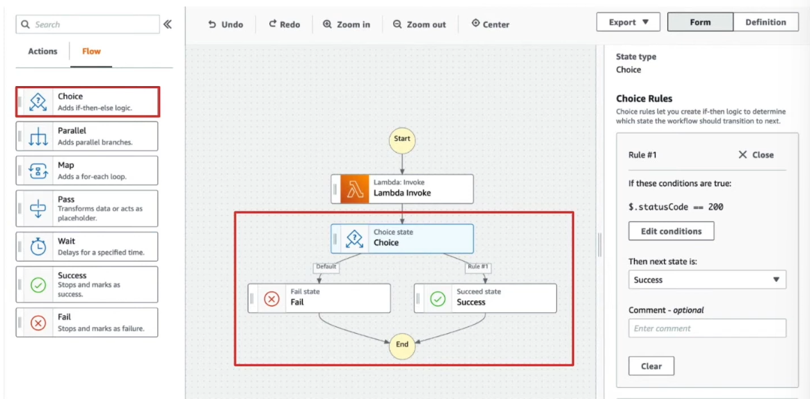
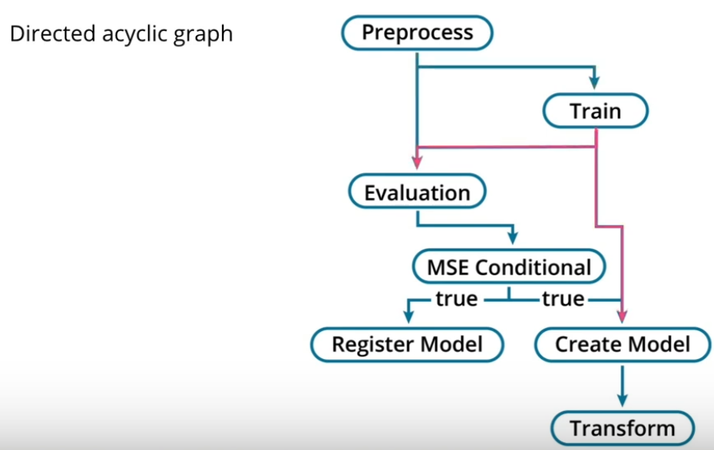

# Design your first workflow
## Glossary
* Workflow - An orchestrated and repeated pattern of activities on data.
* Event-driven - A description describing a process where the end of one activity provokes the next.
* Lambda - A compute service that can launch a small activity in response to an event.
* Step Functions - An orchestration service that can chain services in AWS in an event-driven flow.Placeholder text for glossary.
* Boto3 - AWS Python SDK
* Handler function - Where a Lambda function starts executing
* Payload - A JSON object where a Lambda function can read from as an input parameter.
* Invocation - The process of launching a Lambda function
* Synchronous Invocation - Invocation that expects a response from Lambda
* Asynchronous Invocation - Invocation that does not expect a response from Lambda
* Events - A JSON object sent to Lambda that acts as an input parameter for the launched Lambda function
* S3 Batch Processing - Invoking of a Lambda function in response to an operation on S3, structured as "batches" of objects within an event.
* CloudWatch Event Rules - Invoking a Lambda function in response to the presence of a specific API call within AWS.
* CloudWatch Scheduled Events - Invoking a Lambda function in a regular, scheduled interval.
* Cron - A UNIX utility that can schedule jobs.
* EC2 Instance - A compute server hosted in AWS.
* Step Functions - AWS's orchestration service.
* State Machine - Workflows in Step Functions.
* Tasks- States in a workflow in Step Functions that represent a single unit of work in AWS.
* Function orchestration- Workflow pattern that is the managed, ordered execution of Lambda functions
* Branching- Workflow pattern that is the determination of which path to take based on the prior task's state
* CI (Continuous Integration) - The automation of the integration of individual contributions on shared software projects.
* CD (Continuous Deployment) - The automation of software deployment upon changes to a ‘main’ copy of a project.
* Nodes - Circles in a graph
* Edges - Lines in a graph
* Graph - A set of lines and edges
* Directed Graph - A set of lines and edges where the relationship to and from edges are specified.
* Cycle - Starting with a node, you can follow directed edges properly until you reach the node you started with.
* Directed Acyclic Graph (DAG) - A directed graph with no cycles
* SageMaker Pipelines - An orchestration service specialized for ML operations.
* SageMaker Projects - A management tool for shared resources on an ML team.
* SageMaker Templates - Out-of-the-box ML SageMaker configurations for common ML use cases, such as end-to-end SageMaker Pipelines.
* CloudWatch Billing Alarms is a utility that alerts when a resource on an account is spending money above a threshold

## Intro
In this lesson, you will learn how to automate common ML processes. This will make our ML processes more efficient, less error-prone, and it will allow us to increase the complexity of our ML operations without overwhelming us or our team.

To be more specific, in this lesson we’re going to learn about three tools that will help you accomplish these goals.

* Lambda, which will teach you how to automate small computing tasks.
* State machines in Step Functions, which will let you orchestrate computing tasks into a larger, organized workflow.
* SageMaker Pipelines, which is a specialized orchestration service for ML-related computing tasks.

## ML Workflow Overview
We have a lot of individual components that can make an ML solution, but right now everything is done manually. To address this, in this lesson, we will learn how to:

* Define a workflow
* Create a Lambda function
* Trigger a Lambda function
* Create a Step functions pipeline. (for orchestration)

This will allow us to continuously deliver a deployment-ready ML solution to our users

### Intuition
When creating workflows, we're essentially creating an instruction manual for how to build an ml solution.

When we’re looking at individual components, such as Lambda functions and triggers, try to envision how these components could act as tasks in a larger workflow.

When we’re looking at orchestration solutions, like Step Functions and SageMaker Pipelines, try to envision what specific services would be needed to make the goal of the larger workflow possible.

### What is a workflow

A workflow is “an orchestrated and repeated pattern of activities on data.”

Data is a general term that can refer to, as examples:
* Training Data
* Learned Parameters

Activity is a general term that can refer to, as examples:
* Preprocessing
* Training algorithm.

A Typical ML Workflow

Generally, an ML workflow consists of the following pattern:
* Preprocessing
* Training
* Evaluation
* Deployment

ML workflows are usually event-driven, which means the end of one activity provokes the next. The end of evaluation will start deployment, for example, if the results of the evaluation indicate that a model is ready to face users.

There are many individual steps involved with developing and deploying a ML workflow. It helps organize the order of events by zooming out and understanding the big-picture!

Sagemaker provides us with tools to help make each of the steps involved much simpler!

##### Workflow Tools in AWS
* SageMaker - The essential services from the last lesson are examples of activities.
* Lambda - A compute service that can launch a small activity in response to an event.
* Step Functions - An orchestration service that can chain services in AWS in an event-driven flow.

## Lambda

[Lambda is Amazon’s serverless compute service](https://docs.aws.amazon.com/lambda/latest/dg/welcome.html). Lambda can execute code without specifying underlying infrastructure, like hardware specifications, the operating system, or the maintenance of standard libraries. This service is ideal for small tasks that are frequently repeated.

### How to invoke lambda in python?
Lambda functions can be developed in Python through a Python package called Boto3. Boto3 is the AWS SDK to interact and manage AWS services, including Lambda. You do so through a client:

```python
import boto3
client = boto3.client('lambda')
```

Code is uploaded in boto3 to lambda through the function create_function.

```python
response = client.create_function(
    FunctionName='botoLambdaFunction1',
    Role='arn:aws:iam::565094796913:role/lambda_full_access',
    Code={ 'ZipFile': code})
```

You need the following to invoke a Lambda function:
* Function name,
* Lambda execution role of your function
* The function code. This is done through either a Zip File or an ECR URI.

Your code will be executed starting at the **handler function**. By default, Lambda will look for a file called `lambda_function.py` and search for a function called lambda_handler.

A Lambda function will be executed when a **payload** is delivered to it. A payload is a JSON object which the Lambda function can read from as an input parameter.
### Testing a lambda function
You can test a Lambda function through the console via a **test event**. This test event can either be one that's custom-made by you or it can simulate a call from another AWS service. You can both define and test this event through the AWS Console. You can see logs of the Lambda function in CloudWatch Logs.

### Labmda Demo
[See notebook here](https://github.com/udacity/udacity-nd009t-C2-Developing-ML-Workflow/blob/master/lesson3/demo/Lesson%203%2C%20Lecture%202%20Demo%20-%20Lambda.ipynb)

```python
%%writefile lambda_function.py

# This cell will write the function to your local machine. Note the name of the file and the name of the function. 
# Compare this to the 'Handler' parameter. 

import json

def lambda_handler(event, context):
    """
    event: JSON object
    context: configuration
    
    Return:
        JSON object
    """
    return {
        'statusCode': 200,
        'body': json.dumps('Hello from Lambda!')
    }

import boto3
from sagemaker import get_execution_role
from zipfile import ZipFile

# Your role will need full access to Lambda. The easiest way to add this is through the IAM console. 

role = get_execution_role()

client = boto3.client('lambda')

with ZipFile('code.zip', 'w') as f:
    f.write('lambda_function.py')
    
# If submitting as a ZipFile, you need to insert raw data. 
    
with open('code.zip', 'rb') as f:
    b_code = f.read()

    
# You will need to submit an 'execution role' to Lambda. The easiest way to add this is through the IAM console. 
# You'll need the full ARN (not just the name. )
# Lambda function names also need to be unique within your AWS account. 

response = client.create_function(
    FunctionName='botoLambdaFunction1', # shouldbe unique in yor environment
    Runtime='python3.9',
    Handler='lambda_function.lambda_handler', # file.function
    Code={
        'ZipFile': b_code,
    },
    Description='string',
    Timeout=30,
    MemorySize=1024,
    Publish=True,
    PackageType='Zip',
    Role='arn:aws:iam::565094796913:role/lambda_full_access'
)
```
#### [Lambda via SDK](https://youtu.be/rcAzpq3Olb8)
* Sagemaker doesn't have access to Lambda by default, so we have to make sure the role is added.
    * IAM > Roles > "myrole" > give lambda full access

From the Lambda console, we'll select Create new function. We'll then create an author-from-scratch function that has a runtime environment of Python 3.

We'll then create a test event to see if this function actually works. We’ll click test and then click configure test event. We'll leave the default 'hello-world' event. If we click test, we can see the specified status code and we can also see the specified body in the execution.

What if an error occurred outside a test environment, and we wanted to see what the issue was? Click monitor, then view logs in CloudWatch. We can see logs right here, and clicking through we may be able to see the source of the error.

* Lambda > Functions > see it available
#### [Lambda Console](https://youtu.be/EbKnHlgwjf4)

Lambda > Functions> Create Function
* Function name
* Runtime environment

See logs in Cloudwatch.


From the Lambda console, we'll select Create new function. We'll then create an author-from-scratch function that has a runtime environment of Python 3.

We'll then create a test event to see if this function actually works. We’ll click test and then click configure test event. We'll leave the default 'hello-world' event. If we click test, we can see the specified status code and we can also see the specified body in the execution.

What if an error occurred outside a test environment, and we wanted to see what the issue was? Click monitor, then view logs in CloudWatch. We can see logs right here, and clicking through we may be able to see the source of the error.

### Lambda quiz
* Lambda Handler: The function that's first invoked when Lambda receives a payload
* Serverless: A framework that abstracts away all hardware configuration.
* Payload: A JSON object with parameters to be passed into Lambda function
* For Lambda
  * You have to specify memory and time for function to execute
  * When a payload is received, code will be executed starting at the lambda handler function
* Sagemaker execution roles don't have permission to write Lambda functions

### Lambda Solution
* [Video walkthrough](https://youtu.be/rl7p5ZAqM4w)

First, we'll need to set up the environment:

    1. Navigate to lesson 3 in the course Github repo which contains a python script named HelloBlazePreprocessLambda.py. You will need to rename two constants at the top of the file: BUCKET_NAME and PREFIX. Rename BUCKET_NAME to a bucket in your account, and rename PREFIX to the valid name of your choice. This is where the output of your lambda function will be directed to.
    2. Create an IAM role that allows the lambda function to read and write to S3.
    3. Use the default template to create a PreprocessLambda" lambda function with Runtime Python 3.6.
    4. Create a sample test event from the Hello World template, and confirm that the function is working.
    5. Zip the HelloBlazePreprocessLambda.py and upload it to Lambda.
    6. Upload the zipped file of the musical instrument reviews in the last lesson to S3 if you haven't done so already.
    7. Reconfigure the event so that the time-out is 1 minute (as opposed to the default 3 seconds.)

Then, we'll need to modify the Lambda Handler:

    1. Within the handler, we'll invoke HelloBlazePreprocessLambda's preprocess method.
    2. Within the handler, we'll process an event and extract the s3-data-uri from the event. Events can be interfaced with dictionaries. Use the key "s3-dataset-uri", with the value of the URI in the following format: BUCKET/PREFIX/FILEOBJ.
    3. Within the handler, we'll modify the body of the response returned to more accurately reflect what happened in this job. (i.e., 'Preprocessing Successful!')

Finally, we'll need to test our event.

Create a test event with the key-value pair "s3-dataset-uri": S3_URI_STRING, using the s3 URI of the zipped musical reviews without leading slashes. (See example below)
```shell
{ "s3-dataset-uri": "udacity-sagemaker-bucket/l3e1/reviews_Musical_Instruments_5.json.zip" }
```

#### Code
```python
from HelloBlazePreprocessLambda import preprocess

def lambda_handler(event, context):
    preprocess(event['s3-dataset-uri'])
    return {
        'statusCode': 200,
        'body': "Preprocessing Successful!"
    }
```

## [Trigger lambda](https://youtu.be/2h9tDMzJqV0)

#### Synchronous and Asynchronous Invocations

An invocation is a call to launch a lambda function. There are two types.

Synchronous invocations will launch the function and expect a direct response from the function. As a general rule, you’ll generally be invoking lambda synchronously in ML engineering operations.

Asynchronous invocations don't wait for a response from the code, and when we submit an event, we are really submitting it in a queue to be processed. Asynchronous invocation is used when you don’t want to have to handle all of the replies, and you may not even ever need to handle it.

When designing solutions in AWS that involve Lambda triggers, it’s important to keep these two ways of invoking Lambda in mind and to consult the documentation to confirm which of these options are available to you.

#### Events

An event in AWS is a JSON object that is sent to Lambda to trigger a function, but the structure of the JSON object differs depending on the service sending it. When configuring a service to send events to a lambda function, consult the AWS documentation to determine the structure of the events your function will process.

#### S3 Batch Processing

S3 Batch Processing is the triggering of a Lambda function in response to an operation on S3. The event is structured in "batches" of objects. Below is the format of a sample batch-processing event modified from the documentation. In order to process this event, you’ll need to navigate to the tasks array and process the individual objects in each 'batch'. Note, in particular, the s3BucketArn and s3Key in each object.

```python
{"tasks": [
    {
      "taskID": "dFGaz2lkZ29lc2hmcUI",
      "s3Key": "customerImage1.jpg",
      "s3VersionID": "1",
      "s3BucketArn": "arn:aws:s3:us-east-1:0123456789:examplebucket"
    },
    {
      "taskID": "dFGaz2lkZ29lc2hmcUI",
      "s3Key": "customerImage2.jpg",
      "s3VersionID": "1",
      "s3BucketArn": "arn:aws:s3:us-east-1:0123456789:examplebucket"
    }
]}
```

#### CloudWatch Event Rules
Define rules > Criteria is met > Event > Lambda

CloudWatch Event Rules allows you to define rules on AWS Services that, upon them meeting criteria, will allow you to send an event to certain targets, including Lambda.

e.g.
Search for S3 delete calls > Data deletion found > Event > Preprocessing job lambda function
* You can see impacted buket under "resources" in event
* You can limit this rule to the buckets you specify

Cloudwatch scheduled events - 'CRON' in AWS
* Requires maintenance of infra
* Use this utility in an EC2 instance if you wish
* Alternatively can use cloudwatch scheduled events which requires no maintenance of infrastructure

#### EventBridge

EventBridge, formerly known as CloudWatch Scheduled Events, can be used to invoke ‘cron’ jobs. Cron is a Unix utility that schedules commands to launch on a regular basis. (i.e., hourly, weekly, etc.) In AWS, we can use cron through an EC2 instance (cloud server) that we maintain. However, EventBridge** **offers us the scheduling ability of cron without infrastructure maintenance.

#### Additional resources
If you want to learn more about events, we recommend [Invoking AWS Lambda functions](https://docs.aws.amazon.com/lambda/latest/dg/lambda-invocation.html)
If you want to learn more about EventBridge, we recommend [Creating a CloudWatch Events Rule That Triggers on an Event](https://docs.aws.amazon.com/AmazonCloudWatch/latest/events/Create-CloudWatch-Events-Rule.html)
To read more about EventBridge, visit the Amazon [EventBridge Documentation](https://docs.aws.amazon.com/eventbridge/index.html)
If you want to learn more about S3 Batch Processing, we recommend [Performing large-scale batch operations on Amazon S3 objects](https://docs.aws.amazon.com/AmazonS3/latest/userguide/batch-ops.html)

### [Trigger lambda demo](https://youtu.be/tfqDyKdCLQw)

Notebook: https://github.com/udacity/udacity-nd009t-C2-Developing-ML-Workflow/blob/master/lesson3/demo/Lesson%203%2C%20Lecture%203%20Demo%20-%20Triggering%20Lambda.ipynb

In this demo, we will trigger a Lambda function through CloudWatch Scheduled Events and through the SDK.

#### CloudWatch Scheduled Events

`Cloudwatch > Events > Rules > Create rule`
We'll start with CloudWatch Scheduled Events. We have two options under "rules".

    "Event Pattern" would be what we use if we wanted to send an event based on an API call appearing somewhere.
    "Schedule" is how we can specify a Scheduled Event. There, we can specify an interval and a target. Once done, we need to wait for an interval of the length we specified to elapse before we see any invocations.

If we click through to the lambda function, there are two visual cues that indicate what we've done.

    We can see invocations under "monitor".
    We can see in the "overview" that CloudWatch events were added as a trigger.

Remember to disable any schedule that you've created to avoid cost!
SDK

We'll then trigger a Lambda function in Python through Boto3. Here, similar to how AWS Services can send an event to Lambda, we too can draft an event that we can send to Lambda. The steps to do this are...

    Spin up a boto3 Lambda client.
    Ensure your execution role needs to have access to Lambda.
    From there, you can specify the payload as a JSON-serializable object.
    Convert it into a byte array.
    Call the invoke method.

You can verify that the invocation was successful through the response object.

```python
import boto3
from sagemaker import get_execution_role ## The SageMaker role executing your notebook needs to have Lambda permissions. 
import json

client = boto3.client('lambda')

payload = {'key': 'value'}

# json.dumps turns a JSON-object-like python object into a string, and .encode('utf-8') encodes the 
# the string so that it can be properly passed to the client. 

payload_bytes = json.dumps(payload).encode('utf-8')

response = client.invoke(
    FunctionName='example123',
    InvocationType='Event',
    Payload=payload_bytes
)
```
### Invoke Lambda Functions Notebook
* Youtube: https://youtu.be/4iWU9yV9vos
  * A small error in the demo: at 1:17, the instructor said "how to invoke an s3 function asynchronously". It should be a Lambda function.
* [Notebook](https://github.com/udacity/udacity-nd009t-C2-Developing-ML-Workflow/blob/master/lesson3/Lesson%203%2C%20Exercise%202%20-%20Invoking%20Lambda%20Functions%20Solution.ipynb)

#### Triggering from CLI
```shell
aws lambda invoke --function-name preprocess-helloblze --payload '{"s3-dataset-uri": "udacity-sagemaker-solutiondata2021/l3e1/reviews_Musical_Instruments_5.json.zip"}' response.json
```

    aws lambda is the service we’re using.
    --function-name is the name of the function we're invoking.
    --payload is the payload we want to send to the function.
    response.json is where we want the output of this function to be written to.


#### Triggering from an S3 Upload

We will need to perform the following steps before modifying our lambda code:

    Create a new s3 folder within an existing bucket.
    Create a new lambda trigger for S3, specifying the bucket, specify the folder using the prefix, and specify a suffix of ".zip" to ensure that recursive calls don't occur.

We then need to modify the lambda handler starter code so that it properly parses the event that's sent to it.

To test, we'll upload reviews_Patio_Lawn_and_Garden_5.json.zip in this directory to your S3 bucket. To see if the lambda function is triggered, you can go to the Monitor tab.

#### Code
```python
import json
import urllib
from HelloBlazePreprocessLambda import preprocess

def lambda_handler(event, context):
    for r in event['Records']:
        bucket = r['s3']['bucket']['name']
        key = urllib.parse.unquote_plus(r['s3']['object']['key'], encoding='utf-8')
        uri = "/".join([bucket, key])
        preprocess(uri)
    return {
        'statusCode': 200,
        'body': "Good to go!"
    }
```

## [Create workflows with step functions](https://youtu.be/ke9eI24UAm4)
AWS Orchestration service
#### Fundamental Abstractions
Step Functions is AWS's orchestration service. It is based on two abstractions:
* State Machine: 
  * workflow: An orchestrated and repeatable pattern of activity
* Tasks: States in a workflow that represent a single unit of work in AWS.
  * A single unit of work performed externally
    * Labmda execution, Sagemaker training job, etc
* The two most common patterns in Step Machines for ML engineers are
    * Function orchestration: Managed, ordered execution of Lambda functions
      * 
    * Branching: Determination of which path to take based on the prior task's state
      * 

#### Pros & Cons of Step Functions

Pros

    Intuitive UI
    Easy visualization
    Easy isolation of failure points.

Cons

    Expensive (x100 times of lambda invocations)
    Dependent on proprietary Amazon State Language (Steep learning curve)
    Not compatible with comparable orchestration tools. (e.g. airflows)

#### New Terms

    Step Functions - AWS's orchestration service.
    State Machine - Workflows in Step Functions.
    Tasks- States in a workflow in Step Functions that represent a single unit of work in AWS.
    Function orchestration- Workflow pattern that is the managed, ordered execution of Lambda functions
    Branching- Workflow patter that is the determination of which path to take based on the prior task's state

#### Additional Resources

* If you want to learn more about Step Functions, we recommend What is [AWS Step Functions](https://docs.aws.amazon.com/step-functions/latest/dg/welcome.html)?
* If you want to learn more about invoking SageMaker with Step Functions, we recommend Manage [SageMaker with Step Functions](https://docs.aws.amazon.com/step-functions/latest/dg/connect-sagemaker.html)

### Demo on Create workflows with step functions
Notebook: https://github.com/udacity/udacity-nd009t-C2-Developing-ML-Workflow/blob/master/lesson3/demo/Lesson%203%2C%20Lecture%204%20Demo%20-%20Step%20Functions.ipynb

In this demo, we first utilize Step Functions through the UI, by creating a State Machine. From there, we create two state machines, one which demonstrates function orchestration, while the other demonstrates branching.

#### [Workflow Step Function Visual Editor Demo](https://youtu.be/6kTHkUsYWlc)

#### [Workflow SDK Demo](https://youtu.be/q2usEu4TrXE)
In the demo below, we will show you how to create a step function using SDK with an existing step function definition. You've actually seen a definition from the previous video when creating a step function through the UI. As shown in the image below, you see the definition under the "Definition" section.

You can find the definition of any existing step function under the "Definition" tab within that step function, as shown below.

We then created a state machine in Boto3, using a state machine definition that we took from the UI. We made sure our SageMaker execution role had full access both to StepFunctions and Lambda.

We used an IAM role that had access to Lambda, and with that invoked the create_state_machine function. Once that’s done, you can print the response to see the 200 ‘success’ code. Remember both that state-machine names and job names need to be unique.

```python
response = client.create_state_machine(
    name='boto3StateMachine3', # Names need to be unique. 
    definition=definition,
    roleArn='arn:aws:iam::565094796913:role/service-role/StepFunctions-firstStateMachine-role-0826984a',
    type='STANDARD',
    loggingConfiguration={
        'level': 'OFF'
    }
)
```

Once that was done, we executed this state machine by specifying an execution name, the URI of the state machine, and an input.

```python
response = client.start_execution(
    stateMachineArn='arn:aws:states:us-west-2:565094796913:stateMachine:boto3StateMachine3', # You can find this through the Console or through the 'response' object. 
    name='example1', # Execution names need to be unique within state machines. 
    input='{}' # Input needs to be at least empty brackets. 
)
```


### Create workflows Exercise
### Create workflows Solution
https://github.com/udacity/udacity-nd009t-C2-Developing-ML-Workflow/blob/master/lesson3/Lesson%203%2C%20Exercise%203%20-%20Creating%20Workflows%20with%20Step%20Functions%20Solution.ipynb

Preprocessing Step

This step is quite similar to the Preprocessing Job exercise in lesson 2. The preprocessing step has been encoded for you and you need to input some constants used to execute the code.

    role: the execution role
    PREPROCESSING_JOB_NAME: the name of the preprocessing job
    input_data: the S3 path of the data "Toys_and_Games_5.json.zip"
    input_preprocessing_code: the S3 path of the "HelloBlazePreprocess.py"

role = 'arn:aws:iam::565094796913:role/execution_role'
PREPROCESSING_JOB_NAME = 'test-job6-preprocess'
input_data = 's3://udacity-sagemaker-solutiondata2021/l3e1/Toys_and_Games_5.json.zip'
input_preprocessing_code = 's3://udacity-sagemaker-solutiondata2021/l3e3/HelloBlazePreprocess.py'

Training Step

Upon the success of the preprocessing step, we wish to execute a training step. A training step is also provided to you and you need to fill the constants in the code.

    WORKFLOW_OUTPUT: the S3 path to put the outcome manifests
    TRAINING_JOB_NAM: the name of the training job

WORKFLOW_OUTPUT = "s3://udacity-sagemaker-solutiondata2021/l3e3/workflow_output"
TRAINING_JOB_NAME = "test-job2-train"

Create Workflow & Execute It

The role defined in this step is the Step function role.

workflow_role = 'arn:aws:iam::565094796913:role/step-function-execution-role'

Then you chain the two steps created before and create a workflow.

```python
workflow_graph = Chain([processing_step, training_step])
workflow = Workflow(
    name="SageMakerProcessingWorkflow7",
    definition=workflow_graph,
    role=workflow_role,
)

workflow.create()
```


Next, you execute the workflow.

```python
execution = workflow.execute(
    inputs={
        "PreprocessingJobName": PREPROCESSING_JOB_NAME,  # Each pre processing job (SageMaker processing job) requires a unique name,
        "TrainingJobName": TRAINING_JOB_NAME  # Each Sagemaker Training job requires a unique name,       
    }
)

execution_output = execution.get_output(wait=True)
```

Once the workflow is executed, using the following line of code, you can track the workflow.

execution.render_progress()


## [Sagemaker pipelines](https://youtu.be/VdgdethtWT4)

#### Continuous Integration and Continuous Deployment

CI (Continuous Integration) is the automation of the integration of individual contributions on shared software projects. With CI, when work is checked in, the project is automatically ‘built’ and undergoes a series of tests. Work is only allowed to be merged in with the ‘main’ copy of the project after successfully completing the tests. This practice allows potentially costly errors to be caught early, and also makes it easier to identify the source of such errors, resulting in less time debugging.

CD (Continuous Deployment) is the automation of software deployment upon changes to a ‘main’ copy of a project. This increases productivity in engineering organizations and ensures fast and stable releases.

Because CI and CD have similar requirements and have similar goals, they are often paired together.

#### Directed Acyclic Graphs (DAGs)

A **graph** is a series of circles, which we call nodes, connected by edges, which are lines.
Two circles with a line in between them. (2 nodes and an edge between them)

A **directed graph** maps the relationships from one node to another node. This is done through the arrow symbol.
Two circles with an arrow in between them. (Two nodes with a directed edge between them)

A **cycle** is when, starting with a node, you can follow directed edges properly until you reach the node you started with.
There circles with arrows between all of them, with the orientation of the arrows forming a loop.

A **directed acyclic graph (DAG)** is a directed graph with no cycles. This is often abbreviated as DAG. If we conceive of SageMaker services as nodes, and the event triggers as edges, all SageMaker pipelines are required to be DAGs.

#### [SageMaker Pipelines/Step Functions](https://youtu.be/mlvLJBik5Uo)



SageMaker Pipelines is an orchestration service specialized for ML operations.

They are similar to Step Functions in many ways:

    Easy-to-use UI
    Can be defined through SDK
    Used to architect event-driven workflows.

Because of direct integration, SageMaker Pipelines offers a more intuitive experience in architecting ML workflows. (In some cases, it's also cheaper!)

Why, then, would we want to use Step Functions? SageMaker Pipelines, under the hood, are just Step Functions with a framing that is more friendly to a data scientist. However, there is limited integration between SageMaker Pipelines and other AWS services. In most practical applications, where other AWS services must necessarily be invoked to address the needs of outside stakeholders, Step Functions often offers more utility than AWS SageMaker Pipelines.

#### SageMaker Projects and Templates

SageMaker Projects are the core development components for an engineering team. It is a management tool for shared resources, including pipeline executions, endpoints, and datasets.

SageMaker Templates can act as a basis for SageMaker Projects and are out-of-the-box ML SageMaker configurations for common ML use cases, such as end-to-end SageMaker Pipelines.

#### Additional Resources

* If you want to learn more about CI/CD, we recommend Set Up a [CI/CD Pipeline on AWS](https://aws.amazon.com/getting-started/hands-on/set-up-ci-cd-pipeline/)
* If you want to learn more about SageMaker Pipelines, we recommend [Amazon SageMaker Model Building Pipelines](https://docs.aws.amazon.com/sagemaker/latest/dg/pipelines.html)

## Edge Cases
* Charged
  * # of invocations
  * runtime
  * data transfer out
  * per invocation of lambda function
  * data you take out of S3
* Not Charged
  * configurations
  * Storage of configurations
  * Data transfer in
  * Creating of changing a lambda function
  * Data you put into S3

## [Final Notebook](https://github.com/udacity/udacity-nd009t-C2-Developing-ML-Workflow/blob/master/lesson3/Lesson%203%2C%20Exercise%204%20-%20Tying%20it%20All%20Together%20Solution.ipynb)

https://youtu.be/rKUxX033KaU

In this solution, we will be doing the following.

    Create a new Lambda role.
    Attach to this role the StepFunctionsFullAccess policy.
    Create a new lambda function under the default template, and attach the above new role to it.
    Update the default execution time to 30 seconds.

We'll then be modifying the starter code in the following way:

    Find the definition of our prior Step Function in the AWS Console under 'Step Functions'. Copy-paste this into our function.
    Update the definition with an identical definition, with the only difference being the processing-job name and the training-job name.
    Create a unique step-functions job name.

Then upon executing our Lambda function, we should be able to execute our state machine.

