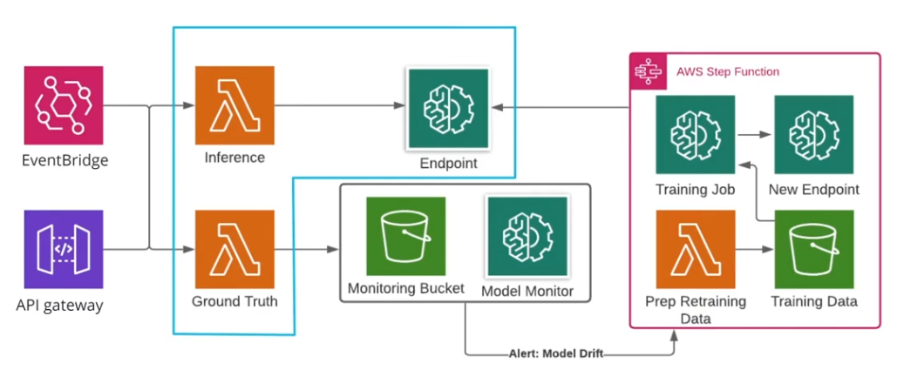

# Monitor ML Workflow

## [Intro](https://youtu.be/erUErNU7HAQ)
In the introduction, we covered the big picture: how can our stakeholders trust our system? How can SageMaker help?

As machine learning engineers, we want to serve our stakeholders with ML systems. Operators want to know how to deploy and observe our systems in production. Our business owners have a direct interest: they want the system to solve our practical business problem. And our users want to know that they can trust the system to treat them fairly and safely.
## [Sagemaker Monitoring](https://youtu.be/0mcJPMTVoUk)
SageMaker offers many ways to address ML engineering challenges.

* CloudWatch and SageMaker Model Monitor are built for logging & monitoring
* SageMaker Model Monitor is built for detecting data and model drift
* SageMaker Feature Store, Sagemaker Training, and Endpoint are built for model ops or MLops
* SageMaker Clarify is built to address issues about responsible AI such as model bias, model explainability
* SageMaker Lambda and Step Function are built for ML workflow orchestration

## Intuition about [ML Monitoring](https://youtu.be/xUJ2XLnQcAY)
What should ML Monitoring do from a practical standpoint? How can it help us impose constraints on our systems? How can it help us automate operations? In this video, we introduced ML Monitoring as a practice and outline our expectations for monitoring solutions.

ML monitoring should:
* Capture events
* Surface operational and ML-specific metrics
  * e.g. number of an error vs successful response
  * e.g. when the model returns inaccurate response
* Emit alerts when events or metrics are outside of the expected range
* Enable automation

## Intro to [sagemaker feature store](https://youtu.be/QV7O1uE7Cno)
https://sagemaker.readthedocs.io/en/stable/amazon_sagemaker_featurestore.html
https://eugeneyan.com/writing/feature-stores/
#### Feature Store Demo: https://youtu.be/LJreOOtm21E
#### Solutions: https://github.com/udacity/udacity-nd009t-C2-Developing-ML-Workflow/blob/master/lesson4/exercises-solutions.ipynb

## [Intro to Monitoring ML models](https://youtu.be/T3ImSB57RHQ)
* Lets you baseline your model and data
* Defines constraints and metrics for your models
* Streams raw data to S3
  * incoming requests / outgoing responses
  * It can be used by monitoring or clarify
* Automatically generates visualizaiton of some metrics
* Can emit alerts

In this video, we talked about ML monitoring. Model Monitor will let you build trust in your ML systems because you can reason about its performance, and use alerts to quickly act on problems in the system. We walked you through a series of code idioms, which demonstrate how you should use the Python SDK for Model Monitor. Below, we share the documentation, which includes related functions and their options.

One of the key objects is the DataCaptureConfig We provide this to the deploy function to capture events from the API (such as requests and responses).

#### Sagemaker model monitor idioms
```python
from sagemaker.model_monitor import DataCaptureConfig

capture_uri = f's3://{bucket}/send/captured/data/here'
data_capture_config = DataCaptureConfig(
    enable_capture=True,
    sampling_percentage=100, # to pass through our model that we want to capture
    destinatiion_s3_uri=capture_uri # customize
)

predictor = model.deploy(
    #...
    data_capture_config=data_capture_config # Must provide this
)
```
Now that we've configured our model for monitoring, we can define a Model Monitor class.

```python
from sagemaker.model_monitor import DefaultModelMonitor

my_monitor = DefaultModelMonitor(
    role=role,
    instance_count=1,
    instance_type='ml.m5.xlarge',
    volume_size_in_gb=20,
    max_runtime_in_seconds=3600,
)
```

Baselining is a powerful capability of Model Monitor that lets us automatically suggest guide rails for our model.

```python
my_monitor.suggest_baseline(
    baseline_dataset=f's3://{bucket}/data/train.csv',
    dataset_format=DatasetFormat.csv(header=False),
)
```

Finally, we can schedule the monitoring job to run hourly (or daily, or any cron expression)

```python
from sagemaker.model_monitor import CronExpressGenerator

my_monitor.create_monitoring_schedule(
    monitor_schedule_name='my_monitoring_schedule_name',
    endpoint_input=predictor.endpoint_name,
    statistics=my_monitor.baseline_statistics(),
    constraints=my_monitor.suggested_constraints(), # hard limits or data types or numerical ranges that we want in input and outputs adhere to
    schedule_cron_expression=CronExpressionGenerator.hourly(), # Model monitor has buffer 20 minutes
)

violations = my_monitor.latest_monitoring_constraint_violations()
statistics = my_monitor.latest_monitoring_statistics()
```

In the Additional Resource section, we share some recommended docs, which contain detailed information about Model Monitor, and related functions that you can use to leverage Model Monitor in your work.

Model monitor has buffer 20 minutes.

If you don't want to wait, then run processing job with my_monitor configurations.

#### Additional Resources

* If you want to know more about how Model Monitor works and different types of monitoring within it, check out the article on [Amazon SageMaker Model.](https://docs.aws.amazon.com/sagemaker/latest/dg/model-monitor.html)
* AWS provides a documentation page that has detailed information about every Model Monitor function, as well as all their required and optional parameters. You can check it out here: [SageMaker Python SDK Model Monitor Docs](https://sagemaker.readthedocs.io/en/stable/amazon_sagemaker_model_monitoring.html)


## [Model Monitor Demo](https://youtu.be/o93ItkbO0Rc)
Notebook: https://github.com/udacity/udacity-nd009t-C2-Developing-ML-Workflow/blob/master/lesson4/demos.ipynb

    Define a data capture configuration for our deployments.
    Define Model Monitor configuration to be scheduled.
    Showed how we schedule the monitoring jobs in a cron format.

We must have DataCaptureConfig set up before deploying the model.


Go to `Sagemaker > endpoints > model monitoring`
* Schedules
  * Summary
* Charts

#### Quiz
* DataCaptureConfig: Configure streaming raw monitoring data to S3
* DefaultModelMonitor: Configure size, timeout, storage, and other settings for Model Monitor
* suggest_baseline: Generates constraints for our Monitor to track over time
* create_monitoring_schedule: Schedule monitoring job

Model monitor does
* Initialize data capture
* schedule monitoring jobs
* configure model monitor resources

```python
# Configure capture of data
data_capture_config = DataCaptureConfig(...)

# deploy a model with data_capture_config
predictor = model.deploy(
    #...
    data_capture_config=data_capture_config)

# Configure the Monitoring Jobs
monitor = DefaultModelMonitor(...)
```

## Model Monitor Exercise
https://github.com/udacity/udacity-nd009t-C2-Developing-ML-Workflow/blob/master/lesson4/exercises-solutions.ipynb

First you need to create a data capture config: Note that enable_capture is True and sampling_percentage=34.
```python
capture_uri = f's3://{bucket}/data-capture'
data_capture_config = DataCaptureConfig(
    enable_capture=True,
    sampling_percentage=34,
    destination_s3_uri=capture_uri)
```

Then you need to use the data capture config to deploy the model. Note the data_capture_config parameter in the code.
```python
xgb_predictor = model.deploy(
    initial_instance_count=1, instance_type='ml.m4.xlarge',
    data_capture_config=data_capture_config)
```

To schedule the monitor, you will need the deployed model xgb_predictor and suggest baslines from the DefaultModelMonitor object (my_monitor).
```python
from sagemaker.model_monitor import CronExpressionGenerator

my_monitor.create_monitoring_schedule(
    monitor_schedule_name='wine-monitoring-schedule',
    endpoint_input=xgb_predictor.endpoint_name,
    statistics=my_monitor.baseline_statistics(),
    constraints=my_monitor.suggested_constraints(),
    schedule_cron_expression=CronExpressionGenerator.hourly(),
)
```

## [Clarify](https://youtu.be/Z6ZuGKz_SA8) 

Amazon SageMaker Clarify provides machine learning (ML) developers with purpose-built tools to gain greater insights into their ML training data and models.

SageMaker Clarify detects and measures potential bias using a variety of metrics so that ML developers can address potential bias and explain model predictions.

SageMaker Clarify in the Python SDK uses a very similar design to Model Monitor. We introduced Clarify, explained some use cases, and walked you through some code idioms to get you started with Clarify in Python. Clarify can help teams to ensure that your models are interacting with users in a responsible way and that their inferences are explainable.

We covered several of the Clarify functions and provided explanations about how we use them. Beginning with the ModelExplainabilityMonitor.

```python
ModelExplainabilityMonitor(
    role=role,
    sagemaker_session=session,
    max_runtime_in_seconds=timeout_duration,
)
```

We also covered how Clarify comes with several of its own configuration functions, depending on what task you're using it for. We shared an example, SHAPConfig for explainability analyses that use the SHAP algorithm.

```python
shap_config = sagemaker.clarify.SHAPConfig(
    ...
)
```

Lastly, we covered how Clarify uses the same create_monitoring_schedule that you learned about when we reviewed Model Monitor.

With these building blocks, you can check your model for biases or for explainability over time, and respond to alerts when it falls out of your acceptable thresholds.

In the Additional Resource section, we share some recommended docs, which contain detailed information about Clarify, and related functions that you can use to leverage Clarify in your work.

    Explainability: Our ability to measure which features of the model is treating as important when it makes an inference.
    SHAP: An algorithm to help explain model outputs. We provide resources on SHAP in the Additional Resources

#### Additional Resources

[The official landing page for SageMaker Clarify](https://aws.amazon.com/sagemaker/clarify/?sagemaker-data-wrangler-whats-new.sort-by=item.additionalFields.postDateTime&sagemaker-data-wrangler-whats-new.sort-order=desc)
[The functions for Clarify are documented on the same page as Model Monitor](https://sagemaker.readthedocs.io/en/stable/api/inference/model_monitor.html)
[Official repository of example notebooks for Clarify](https://sagemaker-examples.readthedocs.io/en/latest/sagemaker-clarify/index.html)
["Why Should I Trust You?" - a paper which introduces explainability in ML and the LIME algorithm.](https://arxiv.org/abs/1602.04938v3)
[An introduction to explainable AI with Shapley values](https://shap.readthedocs.io/en/latest/example_notebooks/overviews/An%20introduction%20to%20explainable%20AI%20with%20Shapley%20values.html)

#### Quiz
* ModelExplainabilityMonitor: Clarify version of the DefaultModelMonitor from the Model Monitor interface
* SHAPConfig: Explainability algorithm configuration in Clarify
* create_monitoring_schedule: Plan a monitoring job for Clarify
* ExplainabilityAnalysisConfig: Example of a Clarify-specific config used to configure analysis jobs
* 

## Clarify Exercise
https://github.com/udacity/udacity-nd009t-C2-Developing-ML-Workflow/blob/master/lesson4/exercises-solutions.ipynb

Great job! In this exercise, you demonstrated how to work with Clarify configuration definitions to set up the SHAP algorithm for explainability monitoring. You used the same define-configure-schedule pattern we applied for Model Monitor to deploy the scheduling job. We provide a reference solution exercise-solution.ipynb in the course Github repo.

In this exercise, you first need to set up the ModelConfig. To do it, you need the deployed model xgb_predictor. And the content_type, accept_type need to be text/csv because the dataset is a csv file.

```python

model_config = sagemaker.clarify.ModelConfig(
    model_name=xgb_predictor.endpoint_name,
    instance_count=1,
    instance_type='ml.m4.xlarge',
    content_type="text/csv",
    accept_type="text/csv")

```

You also need to set up a ExplainabilityAnalysisConfig. You need to pass in the shap_config and model_config.

```python
analysis_config = sagemaker.model_monitor.ExplainabilityAnalysisConfig(
        explainability_config=shap_config,
        model_config=model_config,
        headers=train.columns.to_list())
```

To create a schedule, it's very similar to what you did in the SageMaker Model Monitor section. You need to assign the analysis_config to ExplainabilityAnalysisConfig and define the endpoint using the deployed model xgb_predictor.

```python
explainability_uri = f"s3://{bucket}/model_explainability"
model_explainability_monitor.create_monitoring_schedule(
    output_s3_uri=explainability_uri,
    analysis_config=analysis_config,
    endpoint_input=xgb_predictor.endpoint_name,
    schedule_cron_expression=CronExpressionGenerator.daily(),
)
```

## [Orchestrating model retraining pipeline](https://youtu.be/G44HVll3eAQ)

#### Can I recover automatically from model drift?

How to build model retraining pipeline:


On the far left, data coming in via eventBridge/APIgateway, request from ML prediction or reactions to a ml prediction where users evaluate the accuracy of what our model put out (via inference, ground truth, endpoint). Model monitor can use drift detection capability to send an alert if the model stops giving good inference over time. 

On the far right step function that kicks off as a result of this alert. It preps new training data and stages it in a bucket then a training job is kicked off. Once the new model is created, it can be deployed and replace our current endpoint.

Customize opportunities
* Add tests before deploy
* Alert on multiple metrics
* Send the alerts to a lambda function that implements custom code before we allow the model retraining job to kick off
* Insert manual approvals at the appropriate stages

What gets passed through model retraining pipeline?
* Requests coming to model endpoints from API gateways
* Triggering a model retraining workflow
* Model monitor runs a scheduled processing job

## [Edge cases](https://youtu.be/Kmq9JxkqCm8)
In this video, we walked you through a simplified example of an edge case that our automated model retraining pipeline would likely have trouble handling. We described a working ML system used to help generate marketing copy, and how it begins to break down once the underlying design assumptions break down.

This example highlights the importance of working with SMEs, business stakeholders, and data professionals, especially data scientists. Data scientists may be closer than you to the model, to the methodology behind selecting that type of model. They may have worked with the business owner to document the assumptions behind the methodology, so it may be more obvious to them why the model is breaking.