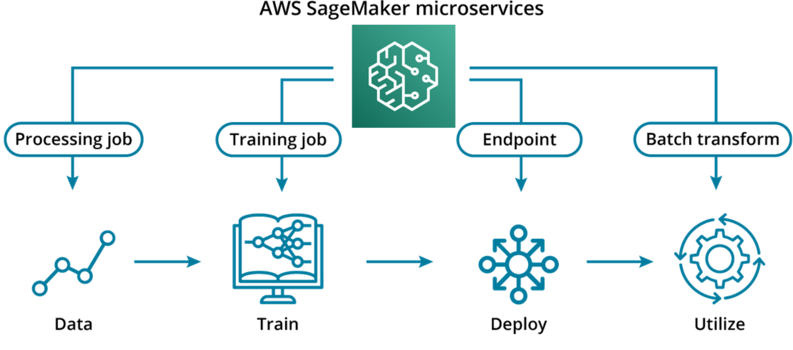

# Intro to developing ML Work flows
## Intro
* Data team: Integrated team of data professionals, the usual place where MLEs would be situated.
* Operations: The teams responsible for compliance, security, and daily maintenance of our IT systems
* Engineering leaderships: The team responsible for aligning the engineering organizations to the overall business
* End user: The users who interact with our ML systems
* Problem owner: The stakeholder who originally hired the data team to solve a business problem

## Glossary
* Monitoring: gathering data about the performance and behavior of systems. These can often be logs, or statistics about the system.
* Deploying: delivering a new resource, or updating to a new version of a resource.
* Bias: model behavior that disadvantages a class of users. (Discussed in this course)
* Model bias: a data science term used to describe how well the model matches its training inputs. (Not discussed in this course)
* Production: the version of our system that we use "for real" i.e. when we present ourselves to users or perform our business function.
* Scale: (in the context of software and AI infrastructure) to decouple the amount of staff devoted to building and running a system from the amount of traffic, users, volume, or data that it can support.
* API: stands for Application Programming Interface. This enables applications to interact with machine learning models easily and securely.

# [Sagemaker Essentials](https://youtu.be/OXJ_5athsbg)
* Training servers replaced by training job, powered by EC2
* Inteference servers replaced by endpoints, powered by EC2
* Data storage replaced by S3



## Glossary
* Training Data - Pre-processed examples (along with labels for supervised learning) to use to train the machine learning model
* Compute Resources - The hosted instance types and counts to be used for the duration of the training job. Larger instance types or greater counts may increase the speed of training at an increasing marginal cost.
* Training Code - The Docker container which holds the environment, libraries and executable code to be deployed on the selected compute resources. This code will incorporate all training steps, allowing only a few parameters to be injected at runtime.
* Job Output - This is the trained model artifact that is the product of running back-propagation over the examples in the training data. This artifact can be hosted to request inferences on new examples.
* Distributed Training - The practice of splitting the computational load of a training job over multiple compute resources.
**Data Parallel Training - ** Splitting raw data intake across multiple compute resources
* Model Parallel Training - Splitting algorithmic computations across multiple compute resources
* Script Mode - Executions of custom training algorithms within SageMaker.
* Model Artifact - A set of trained parameters and a set of instructions for inference stored in S3.
* Container - A consolidated package of a computing runtime environment
* S3 - Simple Storage Service
* ECR - Elastic Container Registry
* CLI - Command Line Interface
* SDK - Source Development Kit
* API - Application Programming Interface
* Interface - A shared methodology through which you can interact with different objects in computing.
* API - An interface between a user and a backend of an application.
* RESTful API - An API that utilizes the REST framework.
* Endpoint - A model in production in SageMaker
* Production - The stage when a trained model is evaluated against new data.
**Deployment - ** The practice of configuring and establishing computing resources to serve your model on a wider scale.
**Multi-Availablity Zone (Multi-AZ) Deployment ** - The deployment of the same resources on different machines that are geographically isolated from each other.
* Availability - Redundancy that ensures the availability of resources
* Autoscaling - The deployment of new resources to meet demand
* Scalability/Elasticity - The ability to acquire resources as you need them and release them as you don't.
* Batch Transform - A compute job that performs inference on a dataset.
* Processing Job - A compute job that performs processing operations on data.
* SKLearnProcessor - A managed processor object with preinstalled sci-kit learn dependencies.
* ScriptProcessor - A processor object that allows you to specify image on ECR
**Entry Point ** - The script that starts your processing job. Input parameters are also specified.
* SageMaker Debugger - A monitoring tool that tracks real-time metrics of SageMaker training jobs
* CloudWatch Logs - The log repository of your compute resources in AWS
IAM (Identity and Access Management) - Management tool for users and permissions within AWS
* CloudWatch - Monitoring tool of deployed resources in AWS


## [2. Developing your intuition about sagemaker](https://youtu.be/0zW8xpDDm7Q)
SageMaker is a set of interconnected microservices meant to be used in conjunction with one another for general use. Keep the following principles in mind when working in SageMaker:

* Outputs of most services are meant to be inputs to other services in SageMaker.
    * e.g. the output of training jobs is meant to be the inputs into endpoints and batch transform jobs
* Interfaces are designed to be very similar and reminiscent of each other
    e.g. the way to submit training jobs through script mode is very similar to submitting processing jobs through a script processor
* Data is encouraged to stay ‘in-house'
    * the only accepted input data into SageMaker is S3 objects
        An 'S3 object' is any binary data stored in s3. This can include datasets or model artifacts.
    * the only accepted input models objects are those generated through SageMaker services
* Common use-cases are often premade
    * many algorithms like Xgboost, linear regression are available and managed by AWS
    * many compute environments with common ML libraries, like Scikit-Learn or Pytorch, are also available and managed by AWS

## [3. Overview](https://youtu.be/qkhK47h_M5A)
* Create Training Jobs
    * To produce not just one, but a series of trained models, we will want to parameterize as much as possible with regards to the input datasets and output artifacts in S3, and which instances to use.
* Deploy Model Endpoints
    * After training a model, we deploy the model to a persistent endpoint to listen for new inference requests using Sagemaker hosting services.
* Process Batch Transforms
    * For cases when we have an entire dataset to be inferred by the trained model, we create a batch transform job using Sagemaker and S3.
* Create Processing Jobs
    * To simplify and automate the pre-processing of inputs or post-processing of outputs, we can leverage processing jobs within Sagemaker to manage much of the extracting, transforming, and loading involved.
* Debug SageMaker
    * All of these processes mentioned are tough to initially implement. We can leverage tools in AWS to help us debug AWS SageMaker services.

## 4. Training jobs
### Ways to launch a training job
* AWS Console - For debugging and initial set-up
* CLI (Command Line Interface) - For one-off jobs.
* AWS SDK (Source Development Kit) - For programmatic access
### Distributed training
Distributed training is the practice of splitting the computational load of a training job over multiple compute resources. This can occur either when the data is significantly large or when an algorithm is significantly complex. Splitting raw data intake across multiple compute resources is called data parallel training, and splitting algorithmic computations across multiple compute resources is called model parallel training.

See additional resources 1

### Script mode
Script mode allows you to create execute a custom script for your training jobs using popular machine learning frameworks like Scikit-learn. This mode allows you to specify custom libraries, run a custom script, and define a model on your own terms while still providing a stable managed container that you can rely on to execute your work.

You can also construct a custom image (copies of a computing system) that meets your specification and upload it to ECR (Elastic Container Registry), and invoke that container (a consolidated package of a computing runtime environment) through SageMaker. AWS will still handle, stably, the underlying OS and hardware.

See additional resources 2

### Model Artifacts
Regardless of how you launch a training job, the result will be a model artifact. This model artifact will be stored in S3, and will consist **both of a set of trained parameters and a set of instructions for inference.**

If you already have a trained model outside of AWS and you wish to incorporate it into the SageMaker environment, you can do so through the CreateModel API (Application Programming Interface). The result of calling this API is also a model artifact.

This model artifact is a required parameter for an endpoint, which is how AWS deploys a model to production.

### Additional resources
* If you want to learn more about distributed training, we recommend you to read Amazon SageMaker [Distributed Training Libraries](https://docs.aws.amazon.com/sagemaker/latest/dg/distributed-training.html).
* If you want to learn more about script mode, we recommend [Bring your own model with Amazon SageMaker script mode](https://aws.amazon.com/blogs/machine-learning/bring-your-own-model-with-amazon-sagemaker-script-mode/)
* If you want to learn more about ECR, we recommend What is Amazon Elastic Container Registry?


## [5. Demo](https://github.com/udacity/udacity-nd009t-C2-Developing-ML-Workflow/tree/master)

### [AWS Console](https://github.com/udacity/udacity-nd009t-C2-Developing-ML-Workflow/tree/master/lesson2/demo_boston_data)

[AWS Console Demo](https://youtu.be/f6t8ZIptJi0)

1) Upload data to S3
2) Go to Sagemaker > Training > Create Training Job
    * Provide a job name
    * Assign an IAM role or create a new IAM role to the job
    * Select an algorithm used to train the model and specify an input mode
    * Specify the resource, such as the instance type, count, additional storage volume, and stoping condition (ml.m5.large)
    * Specify the hyperparameters
    * Specify the input data configurations such as S3 data locations and content type
        * When you specify the content type as a CSV, you implictly define the target. SageMaker takes in the first column of a CSV as the target variable. This is in line with standard practice, as sklearn's to_csv methods also makes the first column the target variable. With the Boston dataset, the target is the median value of a home.
    * Specify the output data configurations such as output location

### [SDK](https://github.com/udacity/udacity-nd009t-C2-Developing-ML-Workflow/blob/master/lesson2/Lesson%202%2C%20Exercise%201%20-%20Training%20Jobs.ipynb)

[SDK Demo](https://youtu.be/id23ZD9GK18)

```python
import sagemaker
import boto3

# Once we know which container to use, we construct the estimator object
session = boto3.session('sagemaker')
sagemaker.estimator.Estimator(container=string, # the image name of the training container
                              role=string, # the IAM role to use
                              instance_count=int, # the number of instances to use for training
                              instance_type=string, # the type of instance to use for training
                              output_path=string, # Where to save the model artifact output
                              sagemaker_session=session) # current sagemaker session
```
This object specifies the training code through the **container**, the permissions it needs through the **role**, the machine that we want to run it on through **instance_type** and **instance_count**, and it does all of this through the **session**.

All of this information is necessary to launch a training job regardless of how we do it. Keep an eye out during the demo to see where, how, and why we set the parameters for our job.

Example:
```python
xgb = sagemaker.estimator.Estimator(container, # The location of the container we wish to use
                                    role,                                    # What is our current IAM Role
                                    instance_count=1,                  # How many compute instances
                                    instance_type='ml.m4.xlarge',      # What kind of compute instances
                                    output_path='s3://{}/{}/output'.format(session.default_bucket(), prefix),
                                    sagemaker_session=session)


xgb.set_hyperparameters(max_depth=5,
                        eta=0.2,
                        gamma=4,
                        min_child_weight=6,
                        subsample=0.8,
                        silent=0,
                        objective='binary:logistic',
                        early_stopping_rounds=10,
                        num_round=500)

s3_input_train = sagemaker.TrainingInput(s3_data=train_location, content_type='csv')
s3_input_validation = sagemaker.TrainingInput(s3_data=val_location, content_type='csv')

xgb.fit({'train': s3_input_train, 'validation': s3_input_validation})
```

You should be able to check the trianing job and the model artifact saved to S3 `model.tar.gz`
* This includes
  * A set of parameters
  * A set of instructions for inference
    * Endpoint: Good for user requests over time
    * Batch transform: Efficient inference of datasets without endpoint

### CLI

[CLI demo](https://youtu.be/F1-DDWNDanA)

Using CLI is quite challenging. Here we showed you an example but following this demo is not required.

When invoking the CLI, here's an example:
```shell
aws sagemaker create-training-job --training-job-name xgboost-cli-demo ----role-arn arn:aws:iam::565094796913:role/execution_role --algorithm-specification TrainingImage=433757028032.dkr.ecr.us-west-2.amazonaws.com/xgboost:1,TrainingInputMode=File --input-data-config file://input_data_config.json --output-data-config S3OutputPath=s3://sagemaker-us-west-2-565094796913/cli-output --resource-config InstanceType='ml.m4.xlarge',InstanceCount=1,VolumeSizeInGB=10 --stopping-condition MaxRuntimeInSeconds=60
```

--role-arn is the execution role. 
--alogorithm-specification is the desired ECR instance. 
--input-data-config is a JSON file that has the desired configuration of input channels.
--output-data-config is the desired location of the output model artifact. 
--resource-config is the desired instance count and instance type that will be running this job.

### Additional resources
* If you want to learn more about how training works in SageMaker, we recommend you to read [Train A Model with Amazon SageMaker](https://docs.aws.amazon.com/sagemaker/latest/dg/how-it-works-training.html)
* If you want to learn more about the SageMaker estimator class, we recommend you to read the [Estimator class documentation](https://sagemaker.readthedocs.io/en/stable/api/training/estimators.html)
* If you want to learn more about interacting with SageMaker using the CLI, we recommend browsing the [Amazon CLI Command Reference](https://awscli.amazonaws.com/v2/documentation/api/latest/reference/sagemaker/index.html)

## [7. Example Nootebook](https://github.com/udacity/udacity-nd009t-C2-Developing-ML-Workflow/blob/master/lesson2/Lesson%202%2C%20Exercise%201%20-%20Training%20Jobs%20Solution.ipynb)

## [9. Endpoint](https://youtu.be/BU6nkBG7djk)
### Restful API
### Endpoint 
In SageMaker, an endpoint is an interface to a model in production. The endpoint allows us to send user data to the model and receives predictions back from the model-based upon that user data.

SageMaker endpoints support the POST definition. Within this POST definition, you can provide a sample that you wish to be processed by your model. The POST request is asking for the ‘creation' of inference.

The configuration for an endpoint includes:
* A model artifact stored in S3
* A configuration for how data is formatted
* Metadata (Version data/Tags)
* Specified computing resources. (Machine type and # of machines)

### Deploying on AWS
Production is a general term used to describe the stage of ML development when your trained model is evaluated against new data. Deployment is the practice of configuring and establishing computing resources to serve your model on a wider scale.

Multi-Availablity Zone (Multi-AZ) Deployment is deploying the same endpoint on different machines that are geographically isolated from each other. This increases the availability of your endpoint.

**Autoscaling** is the configuration of additional machines to serve your endpoint to meet demand. Enabling autoscaling increases the scalability of your endpoint. This is also sometimes referred to as elasticity.

Availability and scalability are possible in AWS because model artifacts that are generated during training jobs are stored in S3. This simple, secure storage allows AWS to copy what is necessary across machines as needed.

### Additional Resources
If you want to learn more about endpoints, we recommend [Deploy Models for Inference](https://docs.aws.amazon.com/sagemaker/latest/dg/deploy-model.html)
    * Batch Transform: Batch transform is suitable for offline processing when large amounts of data are available upfront and you don't need a persistent endpoint. You can also use batch transform for pre-processing datasets. It can support payload sizes of GBs for large datasets and processing times of days.
If you want to learn more about multi-az deployment, we recommend Amazon RDS Under the Hood: [Multi-AZ](https://aws.amazon.com/blogs/database/amazon-rds-under-the-hood-multi-az/)
If you want to learn more about autoscaling, we recommend [What is AWS Auto Scaling?](https://docs.aws.amazon.com/autoscaling/plans/userguide/what-is-a-scaling-plan.html)


### 10. Demo
#### [AWS Console](https://youtu.be/7Ygtp1Uqoik)
To create the endpoint using the console, we first create an endpoint configuration. Then, we're already basically done. We can then use this endpoint configuration via create endpoint. We can confirm the health of our endpoint in the SageMaker Console under 'Endpoints', which is under 'Inference.'

Quick heads-up: if you're doing this through a personal account, there's a limit of 2 instances across your endpoints. Contact AWS support if you want to increase this number.

* Sagemaker > Inference > Endpoints> Create endpoints
#### [SDK](https://youtu.be/Li_LLChbTPM)
Through the SDK, we will **first initiate a boto3 client**. Then, we **obtain the model image uri**, the **model artifact**, and an **execution role**. This is used to **initiate a Model object**. Then, we **call the deploy method**, specifying what kind of instance we want and how many.

```python
role = get_execution_role()
image_uri = image_uris.retrieve(framework='xgboost',region='us-west-2', version='latest')
model_data = "s3://sagemaker-us-west-2-565094796913/boston-xgboost-HL/output/xgboost-2021-08-31-23-02-30-970/output/model.tar.gz"

model = Model(image_uri=image_uri, model_data=model_data, role=role)

predictor = model.deploy(initial_instance_count=1, instance_type="ml.m5.large")
```

##### Using endpoint through SDK
To utilize this endpoint, you can do it programmatically through the SDK's Predictor interface. You pass in the endpoint name and your Boto3 session. Depending on the type of data, you may need to serialize the data. Serializing the data breaks the data down in such a way that it can be recreated later. An example of a predictor object and serialization is shown below.

```python
#deploy the model
deployment = model.deploy(
    initial_instance_count=1,
    instance_type='ml.m5.xlarge',
    )
#get the endpoint name
endpoint = deployment.endpoint_name

#instantiate a Predictor
predictor = sagemaker.predictor.Predictor(
    endpoint,
    sagemaker_session=sagemaker.Session(),
)

#prepare one image for prediction
predictor.serializer = IdentitySerializer("image/png")
with open("test_image.png", "rb") as f:
    payload = f.read()

#use the predictor to make a prediction
inference = predictor.predict(payload)
```
### [13. Example Notebook](https://github.com/udacity/udacity-nd009t-C2-Developing-ML-Workflow/blob/master/lesson2/Lesson%202%2C%20Exercise%202%20-%20Endpoints%20Solution.ipynb)


## [14. Batch transform](https://youtu.be/BRzbmOtysWg)
### Batch Transform
Batch Transform is a compute job that performs inference on a dataset. To invoke Batch Transform, you will need the following:


You should be able to check the trianing job and the model artifact saved to S3 `model.tar.gz`
* This includes
  * A set of parameters
  * A set of instructions for inference
    * Endpoint: Good for user requests over time
    * Batch transform: Efficient inference of datasets without endpoint

#### Requirements
* S3 path to input data: Input path in S3 to the bucket containing the datasets.
* Desired Output path in S3 for the result of the inference results.
* Description of computing resources
* S3 URI of the model artifact.
  * Requires model made through AWS console or `CreateModel` API

A Batch Transformation job is only possible on models created through the AWS Console or through the “CreateModel” operation on the CLI or SDK.

This differs from an endpoint in that endpoints service individual user requests for inference over time.

### Batch Transform (in parallel)
The size of data can be a bottleneck for a transform job. By default, a separate compute resource will be spun up for each individual file in the S3 bucket that you specify. If you wish to split the size of the job even further, you can set the SplitType parameter to "Line". To assemble these split jobs back to a single output file, setAssembleWith parameters to "Line".

* By default separate resources will launch for each FILE in input bucket
* Resources can also be split by `line`
  * if you wish to split the size of a job even further, set the `SplitType` parameter to `line`
  * To assemble these split jobs back to a single output file, set `AssembleWidth` parameter to `line`

```python
import boto3
client = boto3.client('sagemaker')
response = client.create_transform_job(
    TransformJobName='my_job',
    ModelName='target_model_for_inference',
    TransformInput={
        'DataSource': {
            'S3DataSource': {
            'S3DataType': 'S3Prefix',
            'S3Uri': 's3://mybucket/inputfolder/'
         }
     },
    'SplitType': 'Line' # <<<
    },
    TransformOutput={
        'S3OutputPath': 's3://mybucket/outputpath',
        'AssembleWith': 'Line' # <<<
    },
    TransformResources={
    'InstanceType': 'ml.m4.xlarge',
    'InstanceCount': 1}
)
```

### [15. SDK Demo](https://youtu.be/fnFhczaxgXY)

```python
from sagemaker.model import Model
model = Model(image_uri=str, model_data=str, role=str)
transformer = model.transformer(
    instance_count = int,
    instance_type = string,
    output_path = string
)
```

Programmatically, we do this operation in a similar pattern to what we’re used to. First, we’ll create a boto3 session. 
Then, similar to our operations on endpoints, we create a model object utilizing the image uri of Amazon’s XGBoost, our model artifact, and an execution role.

```python
role = get_execution_role()
image_uri = image_uris.retrieve(framework='xgboost',region='us-west-2', version='latest')
model_data = "s3://sagemaker-us-west-2-565094796913/boston-xgboost-HL/output/xgboost-2021-08-31-23-02-30-970/output/model.tar.gz"

model = Model(image_uri=image_uri, model_data=model_data, role=role)
```

Using this model object, we create a transformer object. This is used to perform operations on data, which in this case would be inference. We specify machine type, # of machines, and the output of where we want our transformations to go.

```python
transformer = model.transformer(
    instance_count = 1,
    instance_type = 'ml.m4.xlarge',
    output_path = batch_transform_output_path
)
```

Then, you call the transform method to do the job.

```python
transformer.transform(
    data=data_s3_path,
    data_type='S3Prefix',
    content_type='text/csv',
    split_type='Line'
)
```

### [16. AWS Console Demo](https://youtu.be/ClAb_fsrtPE)
* Get test.csv S3 URI
* Sagemaker > Inference > Batch transform jobs > Create batch transform job
  * Specify job name
  * Find model (which should have been made on AWS)
  * Instance set up
  * Input config
    * s3 Prefix
    * split type
    * Input context type
    * Input data path
  * Output data configuration: set S3 output path
  * Assemble with Line to get a SINGLE file
* You should be able to see in Batch transform jobs how long it took to create the job

### [18. Example Notebook](https://github.com/udacity/udacity-nd009t-C2-Developing-ML-Workflow/blob/master/lesson2/Lesson%202%2C%20Exercise%203%20-%20Batch%20Transform%20Solution.ipynb)

### [How to schedule batch transform jobs using Lambda](https://danielmkeras.medium.com/deploying-on-aws-sagemaker-for-scheduled-batch-transform-f295e49251bc)
```python
from sagemaker import get_execution_role
from sagemaker.model import Model
from sagemaker import image_uris

role = get_execution_role()

image_uri = image_uris.retrieve(framework='blazingtext',region='us-west-2')

model_data = "s3://udacity-sagemaker-solutiondata2021/l2e1/model_artifact/hello-blaze2021-2/output/model.tar.gz"

batch_transform_output_path = "s3://udacity-sagemaker-solutiondata2021/l2e3/batchtransform_output"

model = Model(image_uri=image_uri, model_data=model_data, role=role)

transformer = model.transformer(
    instance_count=1, 
    instance_type='ml.m4.xlarge', 
    output_path=batch_transform_output_path
    
)

transformer.transform(
    data=batch_transform_input_path, 
    data_type='S3Prefix',
    content_type='application/jsonlines', 
    split_type='Line'
)

transformer.wait()
```

## 19. Processing job
A processing job is a compute job that performs a processing operation on data.

A processor object is required for a compute job. Some managed processor objects, like SKLearnProcessor, are managed containers with preinstalled popular libraries, and ScriptProcessor objects allow you to define your own code from scratch**.**

The following is required for a processing job:

* The S3 URIs of the input, and expected local location during the job.
    * Local location refers to a path to a file or folder within an operating system. (Containers are virtualized operating systems.) In this case, we're referring to the path within the container running the processing job.
* The desired S3 URIs of the output, and expected local location during the job.
* Entry point, which is the script that's launched, as well as input parameters.
* Your desired container. (Implicit with managed processor objects.)
* Description of desired compute resources.

### [20. SDK Demo](https://youtu.be/oyvGaWhW-3M)
The idiom that should frame your understanding of this demo is the idea of the Processor object.

This processor object can perform a general operation on datasets, with preinstalled dependencies. This processor implicitly specifies our image. We are responsible for specifying the machine type we want as well as the number of instances.

```python
from sagemaker.sklearn.processing import SKLearnProcessor

Sklearn_processor = SKLearnProcessor(
    framework_version=string,
    role=string,
    instance_type=string,
    instance_count=int
)

# Note that you can't specify custom image in SKLearnProcessor and instead we put version number to framework_version. If you want to use a custom image, use ScriptProcessor.
```
Then we start the processing job by executing the run method of the Processor object. Within the run method, we need to specify:

* The code we wish to use to process the data
* Input channels. (Both S3 and local path within the ProcessingInput)
* Output channels. (The local path within the ProcessingOutput)

```python
sklearn_processor.run(
    code='xgboost_process_script.py',
    inputs=[ProcessingInput(
        source='s3://sagemaker-us-west-2-565094796913/boston-xgboost-HL/train.csv',
        destination='/opt/ml/processing/input/data/')],
    outputs=[ProcessingOutput(source='/opt/ml/processing/output')]
)
```

* Sagemaker > Processing > Processing jobs

### [21. Console Demo](https://youtu.be/XQyZPT5G2WM)

To launch a processing job through the console, we need to specify the following

* A name.
* Desired ECR `image.246618743249.dkr.ecr.us-west-2.amazonaws.com/sagemaker-scikit-learn:0.20.0-cpu-py3`
* An IAM role
* Computing resources, again going for the cheaper option.
* Entry Point: 
  * `python3`
  * `/opt/ml/processing/input/code/xgboost_process_script.py`
* Input channel
    * Data S3 location
    * Data local path:`/opt/ml/processing/input/data`
    * Code S3 location
    * Code local path: `/opt/ml/processing/input/code`
* Output channels
    * Output S3 location
    * Local path: `/opt/ml/processing/output`
* Trigger for upload (End of Job)

With that, we can submit the job and track it through the Processing Jobs landing page.

### [23. Example Notebook](https://github.com/udacity/udacity-nd009t-C2-Developing-ML-Workflow/blob/master/lesson2/Lesson%202%2C%20Exercise%204%20-%20Processing%20Job%20Solution.ipynb)

```python
from sagemaker import get_execution_role
from sagemaker.sklearn.processing import SKLearnProcessor
from sagemaker.processing import ProcessingInput, ProcessingOutput

role = get_execution_role()

sklearn_processor = SKLearnProcessor(framework_version='0.20.0',
                                     role=role,
                                     instance_type='ml.m5.large',
                                     instance_count=1)

sklearn_processor.run(code='HelloBlazePreprocess.py',
                        inputs=[ProcessingInput(
                        source=source_path,
                        destination='/opt/ml/processing/input')],
                      outputs=[ProcessingOutput(source='/opt/ml/processing/output/train'),
                               ProcessingOutput(source='/opt/ml/processing/output/test')]
                     )

```
Consider the following scenario:

    Your colleague tells you that they're having trouble with a processing job in SageMaker. 
    When you ask what the issue is, they tell you that they are testing a model on large datasets, 
    and they are having trouble performing inference on the same image that was used to train it. 
    They elaborate to say that they're using the same # and the same type of instances, 
    as well as the same configuration.

What's the main issue, and what should you tell your colleague to do?
> Processing jobs are made to process data. Batch Transform jobs are built for inferences.

##### SageMaker Debugger

SageMaker Debugger is a monitoring tool that tracks real-time metrics of your training job operation.

Some errors that SageMaker Debugger can catch are...

    Algorithmic Bottlenecks
    Increasing Loss
    Saturated Activation Functions

This tool can allow you to stop training jobs before you needlessly waste compute resources.
CloudWatch Logs

CloudWatch Logs is the log repository of your compute resources in AWS, including SageMaker compute resources.

This tool can help you catch...

    Bugs in your code
    Errors in configuration
